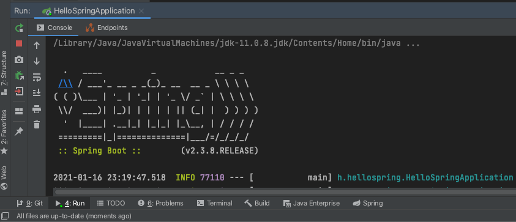
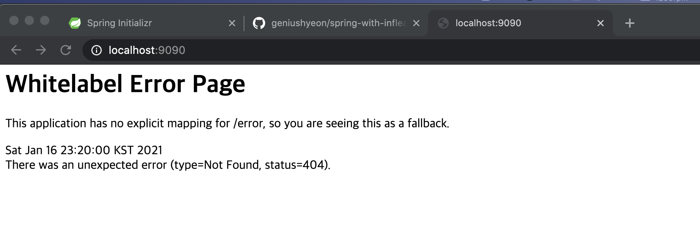

# 프로젝트 환경설정
## 1. 프로젝트 생성
start.spring.io 접속(spring initializr)
1. Gradle로 빌드
2. SNAPSHOT: 아직 정식 배포 전이라는 뜻. 2.3.8 또는 2.4.2를 선택해보자
3. Dependencies 추가
- Spring Web
- Template Engines: Thymeleaf
4. Generate

## 2. IntelliJ로 가져오기
1. 적절한 폴더에 압축 풀기
2. IntelliJ 실행 - Open or Import - 압축 푼 폴더 - `build.gradle` 클릭
3. `Open as Project`

## 3. src 폴더 둘러보기
- main과 test 폴더 나뉘어 있음
  - main 폴더에 실제 코드들이 들어가고 test 폴더에 테스트 코드가 들어감.
  - 그만큼 test code가 중요하다는 뜻

## 4. build.gradle
gradle로 build된 정보를 보여줌. 
- Maven에서 pom.xml이랑 비슷한 듯..?(어디까지나 나의 추측)

## 5. 프로젝트 실행
- main - java - hello.hellospring - HelloSpringApplication.java Run해주기
  - 오라클에서 8080이 실행 중이어서 오류 발생함

- 해결방법
```text
최상단에 Run - Edit Configurations 들어간 후
Environment variables에 server.port=9090 추가
```
<br/>
<br/>
잘 되는 것 확인 완료

