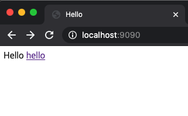
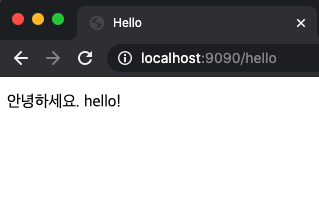
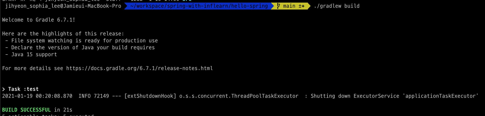
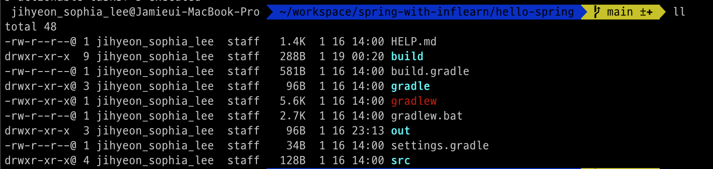
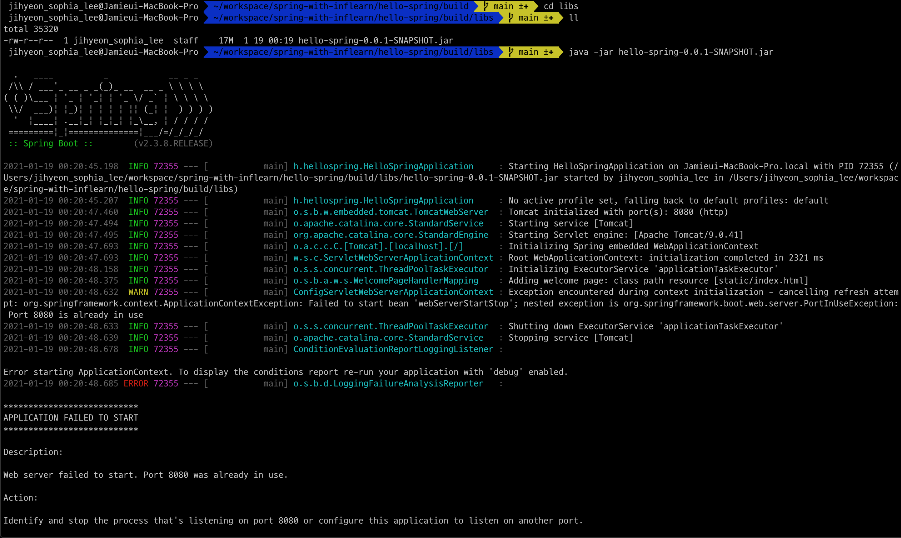

# 라이브러리 살펴보기

## 로그에 대하여
- 현업에서는 `System.out.println()`으로 출력하면 안됨!
  - 로그로 출력해야함.
- 왼쪽 모서리에 있는 네모 클릭 - Gradle 선택하면 들어있는 라이브러리들 볼 수 있음
- org.springframework.boot:spring-boot-starter-logging:2.3.8.RELEASE
  - ch.qos.logback:logback-classic:1.2.3
  - org.slf4j:jul-to-slf4j:1.7.30

## 테스트 라이브러리
- spring-boot-starter-test
  - junit: 테스트 프레임워크

# View 환경설정

## Welcome Page 만들기
- `resources/static` 안에 index.html 넣어 놓으면 알아서 Welcome Page로 인식해줌.
### 1. 정적인 페이지 만들기
```html
<!DOCTYPE html>
<html lang="en">
<head>
    <title>Hello</title>
    <meta http-equiv="Content-Type" content="test/html; charset=UTF-8"/>
</head>
<body>
Hello
<a href="/hello">hello</a>
</body>
</html>
```
- 결과<br/>

### 2. 템플릿 엔진 이용해서 만들기
- Template Engine
  - FreeMarker, Groovy, Thymeleaf, Mustache 등등
  - 이 강의에서는 Thymeleaf 사용

#### 2.1. hello.html 만들기
```html
<!DOCTYPE html>
<html xmlns:th="http://www.thymeleaf.org"> <!--템플릿 엔진 사용 가능-->
<head>
    <title>Hello</title>
    <meta http-equiv="Content-Type" content="text/html; charset=UTF-8"/>
</head>
<body>
<p th:text="'안녕하세요. ' + ${data}">안녕하세요, 손님.</p>
</body>
</html>
```

#### 2.2. HelloController.java 만들기
```java
package hello.hellospring.controller;

import org.springframework.stereotype.Controller;
import org.springframework.ui.Model;
import org.springframework.web.bind.annotation.GetMapping;

@Controller
public class HelloController {

    @GetMapping("hello")
    public String hello(Model model) {
        model.addAttribute("data", "hello!");
        return "hello"; // resources/templates 안에 있는 hello.html을 찾아줘

    }
}

```
- 컨트롤러에서 리턴 값으로 문자를 반환하면 `ViewResolver`가 화면을 찾아서 처리한다.
  - 스프링 부트 템플릿 엔진 기본 viewName 매핑


#### 2.3. 결과 화면


# 빌드하고 실행하기

1. cmd 창에서 프로젝트 폴더로 들어가면
2. `gradlew` 파일이 있다.
3. `./gradlew build` 입력<br/>

   - 각종 라이브러리들을 다운받으며 잘 빌드된다.

4. 빌드가 끝나고 ll 혹은 ls를 입력해보면<br/>

   - build 폴더가 새로 있는 것을 볼 수 있음.
5. `cd build/libs`로 들어가서 ll 혹은 ls를 입력하면
6. `hello-spring-0.0.1-SNAPSHOT.jar` 파일이 있다.
7. `java -jar hello-spring-0.0.1-SNAPSHOT.jar` 입력<br/>

   - 포트번호가 사용 중이라며 실행 실패함..

## 포트번호 변경 방법
- `application.properties` 파일에 `server.port = 9090` 추가
- 추가해준 후 실행하니 잘 됨
  - 첫날에는 IntelliJ의 Edit Configuration에서만 바꿔줬었는데, 이렇게 cmd에서 빌드할 때를 대비해 application.properties에도 추가해주는 게 좋을 듯하다.

- 서버 종료: `Ctrl + C` (커맨드 아님)