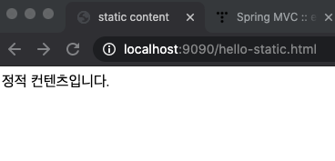
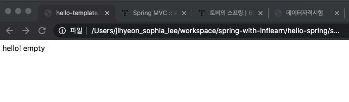
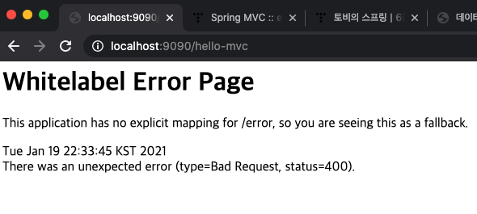
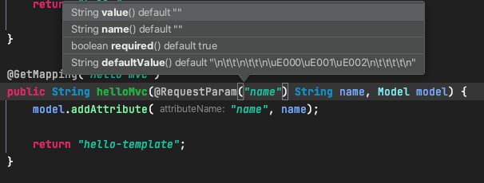
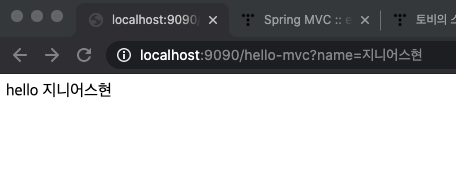
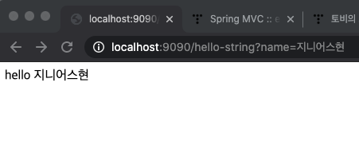
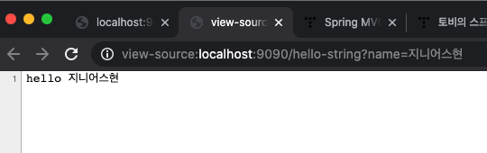
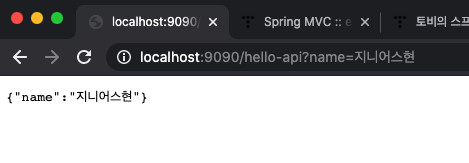

# 정적 컨텐츠 만들기
파일을 그대로 내려준다.
- `resources/static` 안에 만들어주면 된다.
```html
<!DOCTYPE html>
<html lang="en">
<head>
    <title>static content</title>
    <meta http-equiv="Content-Type" content="text/html; charset=UTF-8"/>
</head>
<body>
정적 컨텐츠입니다.
</body>
</html>
```
1. 웹 브라우저에서 localhost:9090/hello-static.html를 입력하면 내장 톰캣 서버가 받음
2. hello-static 관련 Controller가 있는지 찾는다 -> 없다!
3. resources: static/hello-static.html 있는지 찾는다 -> 있다!
4. 웹 브라우저에 반환

- 서버 실행 후 `localhost:9090/hello-static.html` 입력<br/>


# MVC와 템플릿 엔진
Model, View, Controller의 약자
- Model 1 방식: Controller 역할을 View가 같이 담당한다(JSP).
- Model 2 방식: Controller 역할이 분리된다(Servlet).
  - 요즘은 Model 2 방식을 많이 씀
  - View는 화면을 그리는 역할에만 충실해야 한다.


## 1. 동적인 View를 만들어보자
hello-template.html
```html
<!-- thymeleaf 템플릿 엔진 사용 -->
<html xmlns:th="http://www.thymeleaf.org"> 
<body>
<p th:text="'hello' + ${name}">hello! empty</p>
</body>
</html>
```
- p 태그 사이에 hello! empty 쓰는 이유?
  - thymeleaf 엔진의 장점: 서버를 띄우지 않고도 웹 페이지의 껍데기를 볼 수 있다.
  - 파일 - 오른쪽 클릭 - Copy Path - Absolute Path 해서 브라우저에 붙여넣기하면<br/>
<br/>
이렇게 나옴
- 템플릿 엔진으로써 동장하게 되면 p태그 안에 있는 내용으로 치환됨


## 2. Controller 만들기
```java
@GetMapping("hello-mvc")
public String helloMvc(@RequestParam("name") String name, Model model) {
    model.addAttribute("name", name);

    return "hello-template";
}
```

1. 이렇게 해주고 `localhost:9090/hello-mvc` 입력하면<br/>

- Controller에서 파라미터를 name으로 설정해줬는데, 이 name값은 기본적으로 required임.
  - 필수로 들어가야하는 값이 없어서 에러가 뜨는 것. <br/>

- @RequestParam(`"name"`)에 커서 가져간 뒤 `cmd + P` 누르면 확인 가능하다.

2. 해결방법
- GET 방식으로 Param을 주면 정상적으로 페이지가 로딩된다.
  - localhost:9090/hello-mvc`?name=지니어스현`<br/>


# API

## @ResponseBody
  - 바디 부분(html 말고 `HTTP`)에 return 데이터를 직접 넣어줄래
  - view단이 없고 데이터가 그대로 내려감.


- 똑같아 보이지만 오른쪽 클릭 - 소스 보기 누르면


- html 태그가 하나도 없다.

### 객체를 넘겨 보자
- ResponseBody의 진가는 데이터를 넘겨줘야할 때 발휘됨.
- 데이터를 넘겨주기 위해 static class를 하나 만든 후 매핑
```java
@GetMapping("hello-api")
@ResponseBody
public Hello helloApi(@RequestParam("name") String name) {
    Hello hello = new Hello();
    hello.setName(name);

    return hello;
}


static class Hello {
    private String name;

    // Java Bean 규약
    // 프로퍼티 접근 방식
    public String getName() {
        return name;
    }

    public void setName(String name) {
         this.name = name;
    }
}
```

- 객체가 오면 기본적으로 JSON 방식으로 데이터 반환
  - JSON: JavaScript Object Notation: key-value 값 쌍으로 이루어져 있음.

### 작동 원리
- @ResponseBody Annotation 사용
  1. HTTP의 Body에 문자 내용을 직접 반환한다.
  2. hello 객체를 return함
  3. viewResolver 대신 `HttpMessageConverter`가 동작함 
  4. 반환형이 문자열이면 `StringConverter`, 객체면 `MappingJackson2HttpMessageConverter` 동작
      - Gson과 Jackson 두 가지가 있음: Spring에서는 Jackson이 기본