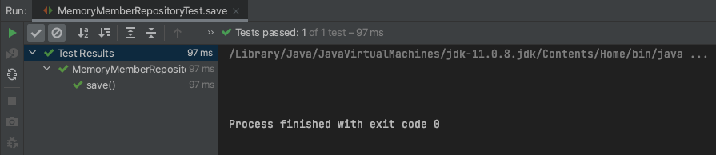
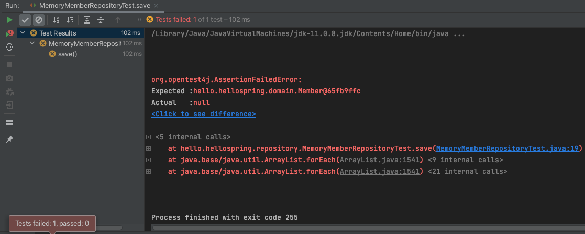
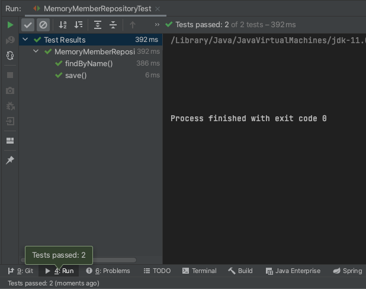
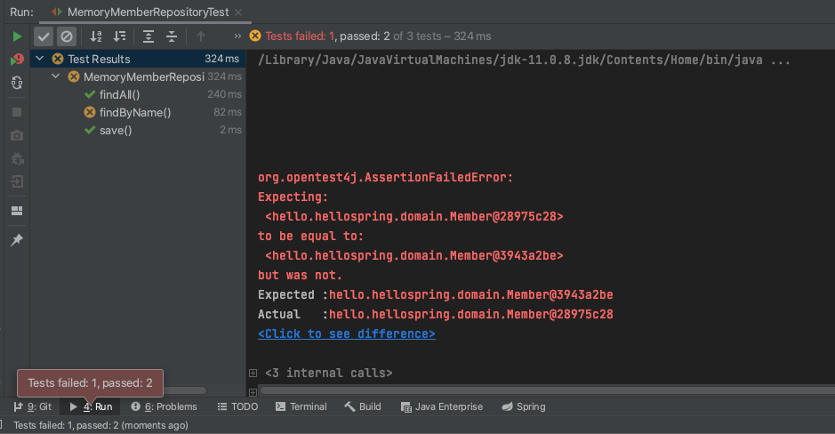
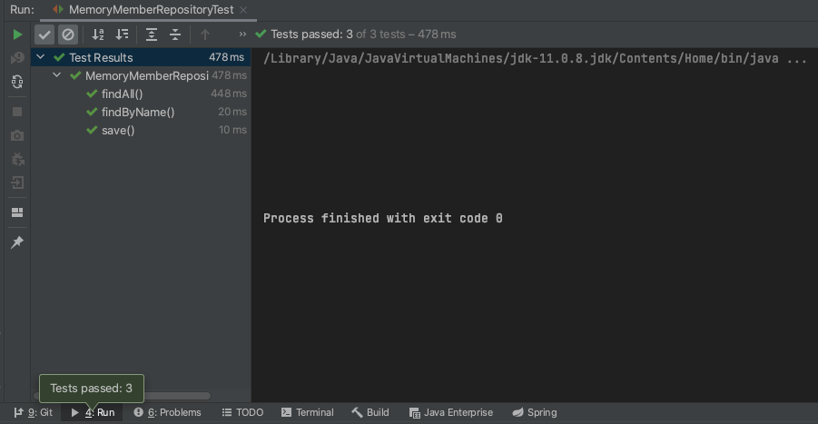

# 회원 관리 예제 - 백엔드 개발

## 1. 비즈니스 요구사항 정리
- 데이터: 회원ID, 이름
- 기능: 회원 등록, 조회

### 1.1. 일반적인 웹 어플리케이션 계층 구조
- Controller: 웹 MVC의 컨트롤러 구현
- Service: 핵심 비즈니스 로직 구현
- Repository: 데이터베이스에 접근, 도메인 객체를 DB에 저장하고 관리
- Domain: 비즈니스 도메인 객체

## 2. 회원 도메인 / 리포지토리 만들기
- Domain: Member.java
```java
package hello.hellospring.domain;

public class Member {

    private Long id;
    private String name;

    public Long getId() {
        return id;
    }

    public void setId(Long id) {
        this.id = id;
    }

    public String getName() {
        return name;
    }

    public void setName(String name) {
        this.name = name;
    }
}
```
- Repository: 인터페이스로 만들고, 향후 인터페이스의 구현체를 만든다.
- Optional<T>
  - Java 8에 들어간 기능.
  - null을 반환할 때 Optional로 감싸서 반환할 수 있음.
```java
package hello.hellospring.repository;

import hello.hellospring.domain.Member;

import java.util.List;
import java.util.Optional;

public interface MemberRepository {
    // insert
    Member save(Member member);
    // select
    Optional<Member> findById(Long id);
    Optional<Member> findByName(String name);
    List<Member> findAll();

}
```
- MemoryMemberRepository.java
  - MemberRepository의 구현체

```java
package hello.hellospring.repository;

import hello.hellospring.domain.Member;

import java.util.*;

public class MemoryMemberRepository implements MemberRepository {

    // 동시성 문제 때문에 실무에선 다른 방법이 쓰임. 최대한 간단한 방법으로
    private static Map<Long, Member> store = new HashMap<>();
    private static long sequence = 0L;

    @Override
    public Member save(Member member) {
        member.setId(++sequence);
        store.put(member.getId(), member);

        return member;
    }

    @Override
    public Optional<Member> findById(Long id) {
        return Optional.ofNullable(store.get(id));
    }

    // 람다 공부 필요..
    @Override
    public Optional<Member> findByName(String name) {
        return store.values().stream()
                .filter(member -> member.getName().equals(name))
                .findAny();
    }

    @Override
    public List<Member> findAll() {
        return new ArrayList<>(store.values());
    }
}
```

## 3. 테스트 케이스 작성하기
- 내가 만든 코드가 정상 작동하는지 테스트하기 위한 코드.
- 자바의 main 메소드를 통해 실행하거나 웹 어플리케이션의 컨트롤러를 통해 해당 기능을 실행
  - 1) 준비하는 데 오래 걸리고 2) 반복 실행하기 어렵고 3) 여러 테스트를 한번에 실행하기 어렵다는 단점이 있음.
  - `JUnit`이라는 프레임워크로 테스트를 실행하면 이러한 문제를 해결할 수 있음.

1. `src/test/java` 아래에 생성한다.
2. `테스트할클래스이름` + Test.java
3. 굳이 public으로 안해도 됨.
4. Test method 위에 `@Test` 어노테이션 붙여주기

### 3.1. save, findById 테스트
- MemoryMemberRepositoryTest.java
```java
package hello.hellospring.repository;

import hello.hellospring.domain.Member;
import org.junit.jupiter.api.Assertions;
import org.junit.jupiter.api.Test;

class MemoryMemberRepositoryTest {

    MemoryMemberRepository repository = new MemoryMemberRepository();

    @Test
    public void save() {
        Member member = new Member();
        member.setName("spring");

        repository.save(member);

        Member result = repository.findById(member.getId()).get();
        Assertions.assertEquals(member, result);
    }

}
```
- Assertions.assertEquals(member, result);
  - org.junit.jupiter.api.Assertions 패키지에 있음
  - save 메소드로 넣은 멤버와 repository에서 꺼낸 member(=result)가 같은지 확인해줘
  - 사용 방법: Assertions.assertEquals(기대하는 값, 실제 값)
- 결과<br/>

- 아무 일도 안 일어난 것 같지만 코드를 살짝 바꿔서 실행해보면
```java
Assertions.assertEquals(member, null);
```
<br/>
- 실패했다고 잘 뜸.

#### 3.1.1. 또다른 방법
- org.assertj.core.api에 있는 Assertions 사용하기
```java
import org.assertj.core.api.Assertions;

Assertions.assertThat(member).isEqualTo(result);
```
- 문법이 좀 더 직관적이다.
- 실무에서는 빌드 툴과 엮어서 테스트가 실패하면 다음 단계로 못 넘어가게끔 한다.

### 3.2. findByName 테스트
- 💡 Rename 단축키: `Shift + F6`
  - keycron 키보드에서는 `Shift + Fn2 + 6`

```java
@Test
public void findByName() {
    Member member1 = new Member();
    member1.setName("lee");
    repository.save(member1);

    Member member2 = new Member();
    member2.setName("yoon");
    repository.save(member2);

    Member result = repository.findByName("lee").get();

    Assertions.assertThat(result).isEqualTo(member1);
    }
```

### 3.3. 클래스 레벨에서 테스트하기
- 메소드 레벨이 아니라 클레스 레벨에서 테스트해볼 수 있다.<br/>



### 3.4. findAll 테스트하기
```java
@Test
public void findAll() {
    Member member1 = new Member();
    member1.setName("lee");
    repository.save(member1);

    Member member2 = new Member();
    member2.setName("yoon");
    repository.save(member2);

    List<Member> result = repository.findAll();

    Assertions.assertThat(result.size()).isEqualTo(2);

    }
```

### 3.5. 전체 코드 작성 후 클래스 레벨에서 테스트
<br/>
- findAll()이 실행되고 findByName()이 실행되었는데, 두 메소드에서 겹치는 데이터가 있기 때문에 오류가 나는 것.
- 테스트 순서는 보장할 수 없음.
  - 때문에 한 테스트가 끝나면 데이터를 clear해줘야 한다.
  - `@AfterEach` 어노테이션을 붙여주면 각 테스트 코드가 끝난 후 무조건 그 메소드를 실행하게 된다.

1. MemoryMemberRepository 클래스에 데이터를 비울 수 있는 메소드를 먼저 만들어준다.
```java
// Map의 clear() 메소드
public void clearStore() {
    store.clear();
}
```

2. 테스트 코드에 1번 메소드를 가져온 afterEach 메소드를 만들어준다.
```java
@AfterEach
public void afterEach() {
    repository.clearStore();
}
```

3. 다시 테스트해본다.
<br/>
- 성공

#### 테스트 주도 개발
- 테스트 케이스를 먼저 만든 후 메인 코드를 만드는 것