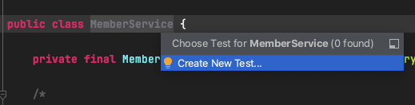
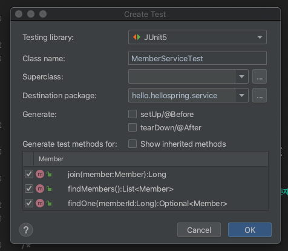
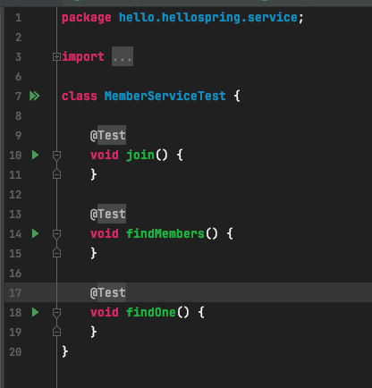
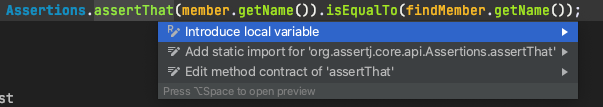
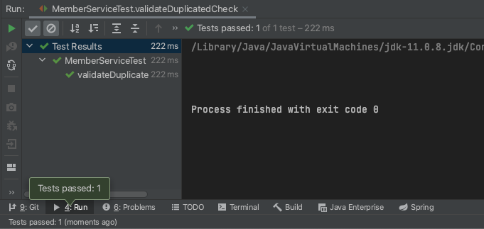
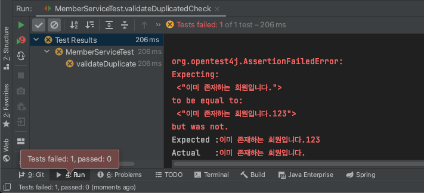
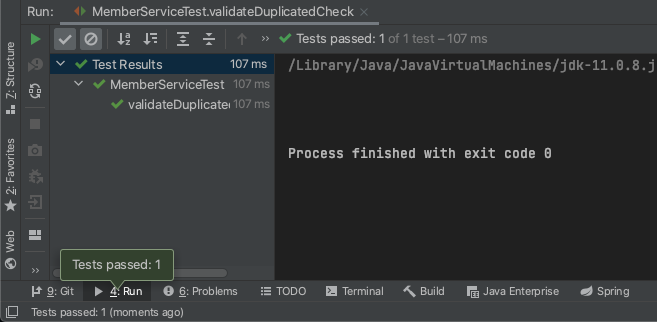

# 회원 서비스 개발

## 1. MemberService
비즈니스에 의존적으로 설계
- Repository는 기계적으로 개발스럽게(?) 용어들을 선택한다.
### 1.1. 회원가입
- 이름이 중복된 회원은 가입이 불가능하다고 가정하고 작성
```java
package hello.hellospring.service;

import hello.hellospring.domain.Member;
import hello.hellospring.repository.MemberRepository;
import hello.hellospring.repository.MemoryMemberRepository;

import java.util.Optional;

public class MemberService {

    private final MemberRepository memberRepository = new MemoryMemberRepository();

    /*
     * 회원가입
     * */
    public Long join(Member member) {
        // 이름 중복 회원 X
        Optional<Member> result = memberRepository.findByName(member.getName());
        result.ifPresent(m -> {
            throw new IllegalStateException("이미 존재하는 회원입니다.");
        });


        memberRepository.save(member);

        return member.getId();
    }

}
```
- 💡 변수 추출하기 (Extract -> Variable): `cmd + opt + v` 

#### 📝 Option<T>에 관하여
- 위 코드의 경우 Member가 Optional로 한 번 더 감싸지는 것이기 때문에, Optional의 여러 메소드를 사용할 수 있다.
- .ifPresent(): 어떤 값이 있으면 어떤 로직을 실행해줘
  - if (result != null)과 같다.
- .orElseGet(): 값이 있으면 꺼내고 없으면 어떤 로직을 실행해줘

- result 변수를 만들지 않고 바로 쓸 수도 있다.
```java
public Long join(Member member) {
    // 이름 중복 회원 X
    memberRepository.findByName(member.getName())
            .ifPresent(m -> {
                throw new IllegalStateException("이미 존재하는 회원입니다."); 
            });
        
    memberRepository.save(member);

    return member.getId();
}
```
- findByName(블라블라~ ...) 이렇게 로직이 있을 때는 메소드로 뽑는 것이 좋다.
  - 💡 리팩토링 관련 단축키 `ctrl + T`(커맨드아님) -> Extract Method해서 따로 뽑아주기.

```java
/*
 * 회원가입
 * */
public Long join(Member member) {
    // 이름 중복 회원 X
    validateDuplicatedMember(member);

    memberRepository.save(member);

    return member.getId();
}

private void validateDuplicatedMember(Member member) {
    memberRepository.findByName(member.getName())
            .ifPresent(m -> {
                throw new IllegalStateException("이미 존재하는 회원입니다.");
            });
}
```

### 1.2. 전체 코드
```java
package hello.hellospring.service;

import hello.hellospring.domain.Member;
import hello.hellospring.repository.MemberRepository;
import hello.hellospring.repository.MemoryMemberRepository;

import java.util.List;
import java.util.Optional;

public class MemberService {

    private final MemberRepository memberRepository = new MemoryMemberRepository();

    /*
     * 회원가입
     * */
    public Long join(Member member) {
        validateDuplicatedMember(member); // 중복 회원 검증
        memberRepository.save(member);

        return member.getId();
    }

    private void validateDuplicatedMember(Member member) {
        memberRepository.findByName(member.getName())
                .ifPresent(m -> {
                    throw new IllegalStateException("이미 존재하는 회원입니다.");
                });
    }

    /*
    * 전체 회원 조회
   * */
    public List<Member> findMembers() {
        return memberRepository.findAll();
    }

    public Optional<Member> findOne(Long memberId) {
        return memberRepository.findById(memberId);
    }

}
```

## 2. MemberService 테스트
이전에는 test 폴더 아래에 클래스를 새로 만들었었는데, 💡 `cmd + shift + T`를 누르면 바로 Test를 만들 수 있다.<br/>
<br/>
- 클릭하면<br/>
<br/>
- 이런 창이 뜬다.
  - Test library는 `JUnit5`를 선택하고, 테스트할 메소드를 체크한 후 OK를 누르면 됨.
  - 그러면 틀을 만들어주는데, 직접 만들 때와 동일하게 `test/java` 아래에 만들어진다.


### 2.1. given ~ when ~ then
```text
// given
뭔가가 주어졌는데
(이 데이터를 기반으로 하는구나)
// when
그런 상황일 때
(이걸 검증하는구나)
// then
이게 나와야 해
(여기가 검증하는 부분이구나)
```

### 2.2. 회원가입 테스트
```java
MemberService memberService = new MemberService();

@Test
void join() {
    // given
    Member member = new Member();
    member.setName("hello");
    // when
    Long savedId = memberService.join(member);

    // then
    // 저장한게 repository에 있는게 맞아?
    Member findMember = memberService.findOne(savedId).get();
    assertThat(member.getName()).isEqualTo(findMember.getName());

}
```
- 💡 static import: static import하고싶은 곳에 커서 가져간 뒤 `opt + Enter` -> add static import for~
<br/>

#### 2.2.1. 예외 테스트(1)
모든 테스트는 정상 테스트보다 `예외 테스트`가 훨씬 중요하다.
- 이름이 중복되는 회원은 가입이 불가능하므로 중복확인 테스트 코드를 만든다.
```java
@Test
public void validateDuplicatedCheck() {
    // given
    Member member1 = new Member();
    member1.setName("spring");

    Member member2 = new Member();
    member2.setName("spring");

    // when
    memberService.join(member1);
    try {
        memberService.join(member2);
        fail();
    } catch (IllegalStateException e) {
        assertThat(e.getMessage()).isEqualTo("이미 존재하는 회원입니다.");
    }

    // then
}
```

- MemberService 클래스에서 같은 이름이 존재하면 "이미 존재하는 회원입니다."라는 메시지를 뿌려주도록 했는데, 예외를 catch했을 때 그 예외의 메시지가 "이미 존재하는 회원입니다."와 같으므로 테스트 성공.
- 만약 메시지를 바꿔보면<br/>
<br/>

#### 2.2.2. 예외 테스트(2)
assertThrows를 이용해서 작성해보자.
```java
 @Test
public void validateDuplicatedCheck() {
    // given
    Member member1 = new Member();
    member1.setName("spring");

    Member member2 = new Member();
    member2.setName("spring");

    // when
    memberService.join(member1);
    assertThrows(IllegalStateException.class, () -> memberService.join(member2));
}
```
- assertThrows(이 예외가 터져야 함, () -> 어떤 로직을 태울 때);
  - 람다 언제 공부하지..<br/>

- IllegalStateException 말고 다른 에러를 넣으면 테스트 실패함.

#### 2.2.3. 예외 테스트(3)
예외 메시지 검증하기
```java
IllegalStateException e = assertThrows(IllegalStateException.class, () -> memberService.join(member2));
assertThat(e.getMessage()).isEqualTo("이미 존재하는 회원입니다.");
```

💡 2.2.2. 코드에서 `cmd + opt + v`

#### 2.2.4. 데이터 clear해주는 메소드 만들기
어제 만들었던 테스트 케이스에서 가져온다.

```java
MemoryMemberRepository memoryMemberRepository = new MemoryMemberRepository();

@AfterEach
public void afterEach() {
    memoryMemberRepository.clearStore();
}
```
- 이렇게 되면 테스트 케이스에 있는 memoryMemberRepository와 MemberService에 있는 repository가 서로 다른 인스턴스여서 애매해진다.
    - 1. MemberService에서 memoryMemberRepository를 생성해주는 생성자를 만들고
    - 2. MemberServiceTest에서 각 테스트가 실행되기 이전에 memoryMemberRepository를 생성할 수 있도록 `@BeforeEach` 어노테이션을 붙인 메소드를 생성해준다.
    - 이것이 바로 DI(Dependency Injection, 의존성 주입)

MemberService.java
```java
private final MemberRepository memberRepository;

public MemberService(MemberRepository memberRepository) {
    this.memberRepository = memberRepository;
}
```
MemberServiceTest.java
```java
MemberService memberService;
MemoryMemberRepository memoryMemberRepository;

@BeforeEach
public void beforeEach() {
    memoryMemberRepository = new MemoryMemberRepository();
    memberService = new MemberService(memoryMemberRepository);
}
```