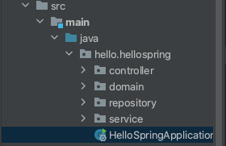

# 스프링 빈 등록하기

## 1. 컴포넌트 스캔과 자동 의존관계 설정

### 1.1. MemberController 만들기
`@Controller` 어노테이션이 붙으면 스프링 컨테이너에서 관리함.
```java
@Controller
public class MemberController {
    private final MemberService memberService = new MemberService();
    ...
}
```
이런 식으로 new 연산자를 이용해 생성해줄 수도 있지만, 스프링이 관리하게 되면 전부 스프링 컨테이너에 등록하여 컨테이너로부터 받아 와서 쓰도록 바꿔줘야 함.
- 스프링 컨테이너에 딱 하나만(`Singleton`) 등록해서 사용
  - 따라서 같은 스프링 빈이면 모두 같은 인스턴스임.
  -  `@Autowired`: 스프링 컨테이너에 등록되어 있는 Bean과 연결시켜줌.


```java
package hello.hellospring.controller;

import hello.hellospring.service.MemberService;
import org.springframework.beans.factory.annotation.Autowired;
import org.springframework.stereotype.Controller;

@Controller
public class MemberController {

    private final MemberService memberService;

    @Autowired // 생성자를 통한 DI
    public MemberController(MemberService memberService) {
        this.memberService = memberService;
    }
}
```
실행시켜보면
```text
Parameter 0 of constructor in hello.hellospring.controller.MemberController required a bean of type 'hello.hellospring.service.MemberService' that could not be found.
```
- 스프링 빈에 MemberService가 등록되어 있지 않기 때문에 오류 발생
  - MemberService 클래스에 `@Service` 어노테이션 추가
### 1.2. MemberService.java 수정
```java
package hello.hellospring.service;

import hello.hellospring.domain.Member;
import hello.hellospring.repository.MemberRepository;
import org.springframework.beans.factory.annotation.Autowired;
import org.springframework.stereotype.Service;

import java.util.List;
import java.util.Optional;

@Service // 어노테이션 추가
public class MemberService {

    private final MemberRepository memberRepository;

    @Autowired // 생성자를 통한 주입
    public MemberService(MemberRepository memberRepository) {
        this.memberRepository = memberRepository;
    }

    /*
     * 회원가입
     * */
    public Long join(Member member) {
        validateDuplicatedMember(member); // 중복 회원 검증
        memberRepository.save(member);

        return member.getId();
    }

    private void validateDuplicatedMember(Member member) {
        memberRepository.findByName(member.getName())
                .ifPresent(m -> {
                    throw new IllegalStateException("이미 존재하는 회원입니다.");
                });
    }

    /*
    * 전체 회원 조회
   * */
    public List<Member> findMembers() {
        return memberRepository.findAll();
    }

    public Optional<Member> findOne(Long memberId) {
        return memberRepository.findById(memberId);
    }

}
```

### 1.3. Annotation 살펴보기
- 💡 cmd + @Service 어노테이션 클릭하면 정보를 볼 수 있음(해당 클래스로 이동.)
```java
package org.springframework.stereotype;

import java.lang.annotation.Documented;
import java.lang.annotation.ElementType;
import java.lang.annotation.Retention;
import java.lang.annotation.RetentionPolicy;
import java.lang.annotation.Target;

import org.springframework.core.annotation.AliasFor;

@Target({ElementType.TYPE})
@Retention(RetentionPolicy.RUNTIME)
@Documented
@Component
public @interface Service {

	/**
	 * The value may indicate a suggestion for a logical component name,
	 * to be turned into a Spring bean in case of an autodetected component.
	 * @return the suggested component name, if any (or empty String otherwise)
	 */
	@AliasFor(annotation = Component.class)
	String value() default "";

}

```
- `@Component` 어노테이션이 붙으면 스프링에서 관리한다.
  - `@Repository`, `@Controller`도 마찬가지

### 1.4. 아무데나 어노테이션을 붙여도 되는가?
src/main/java 하위에 demo 패키지를 만들고, Demo.java 클래스를 만들었다고 가정해보자.
```java
@Service
public class Demo {
    ...
}
```
- 결론부터 말하면 안 됨.<br/>
<br/>
- hello/hellospring 패키지의 HelloSpringApplication.java에서부터 스프링이 시작되는 것이기 때문에 상위에 패키지를 만들고 빈으로 등록해도 인식할 수 없다.
  - hello.hellospring 하위 패키지에 있어야 스프링이 관리함.
```java
package hello.hellospring;

import org.springframework.boot.SpringApplication;
import org.springframework.boot.autoconfigure.SpringBootApplication;

@SpringBootApplication
public class HelloSpringApplication {

	public static void main(String[] args) {
		SpringApplication.run(HelloSpringApplication.class, args);
	}

}
```
## 2. 자바 코드로 직접 스프링 빈 등록하기
앞서 등록했던 `@Autowired`, `@Service`, `@Repository` 어노테이션 제거한 후 시작
```java
package hello.hellospring;

import hello.hellospring.repository.MemberRepository;
import hello.hellospring.repository.MemoryMemberRepository;
import hello.hellospring.service.MemberService;
import org.springframework.context.annotation.Bean;
import org.springframework.context.annotation.Configuration;

@Configuration
public class SpringConfig {

    @Bean
    public MemberService memberService() {
        return new MemberService();
    }

}

```
- return new MemberService(여기);에 파라미터가 없어 오류가 발생한다.
  - 💡 `cmd + P` : 현재 위치한 메소드의 파라미터 정보 조회
  - 아래쪽에 MemberRepository를 Bean으로 등록하고 그 빈을 가져옴.
```java
package hello.hellospring;

import hello.hellospring.repository.MemberRepository;
import hello.hellospring.repository.MemoryMemberRepository;
import hello.hellospring.service.MemberService;
import org.springframework.context.annotation.Bean;
import org.springframework.context.annotation.Configuration;

@Configuration
public class SpringConfig {

    @Bean
    public MemberService memberService() {
        return new MemberService(memberRepository());
    }

    @Bean
    public MemberRepository memberRepository() {
        return new MemoryMemberRepository();
    }
}
```
### 2.1. 참고사항
- XML로 설정하는 방법도 있지만 최근에는 잘 사용하지 않음.
- DI의 종류
  - 1) 필드 주입 - 별로 안 좋음
  - 2) setter 주입 - 얘도 별로 안 좋음: 아무 개발자나 호출할 수 있음..
  - 3) 생성자 주입 ✔︎
  - 세 가지 방법이 있는데, 의존 관계가 실행 중에 동적으로 변하는 경우는 거의 없으므로 생성자 주입을 권장

```java
@Controller
public class MemberController {
    // 필드 주입
    @Autowired private MemberService memberService;

    // setter 주입
    @Autowired
    public void setMemberService(MemberService memberService) {
        this.memberService = memberService;
    }
}
```
- 실무에서는 주로 정형화된 컨트롤러, 서비스, 리포지토리 같은 코드는 `컴포넌트 스캔`을 사용한다. 그리고 정형화되지 않거나, 상황에 따라 구현 클래스를 변경해야 하면 `설정`을 통해 스프링 빈으로 등록한다.
  - ex) 처음에 DB랑 연결을 하지 않았다가 DB 연결을 해서 구현 클래스를 변경해야 하는 경우