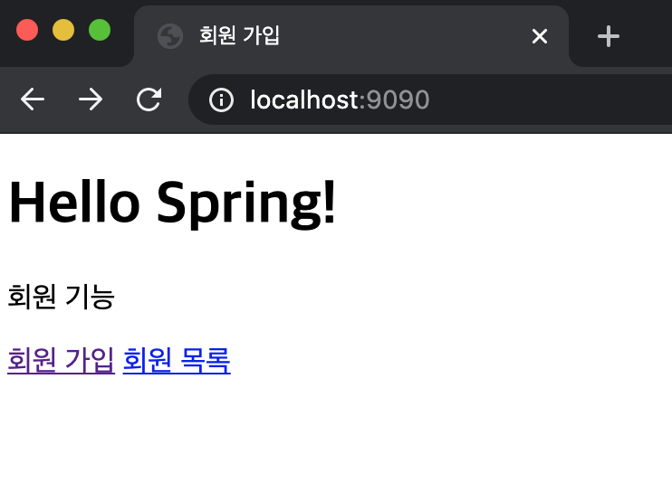
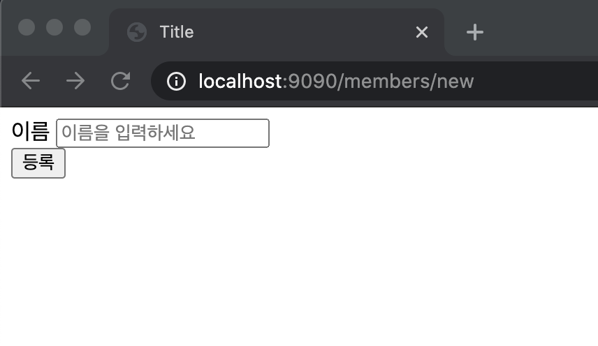
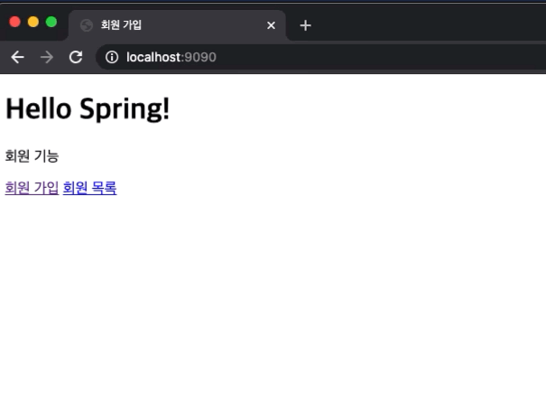

# 회원 관리 예제 - 웹 MVC 개발

## 1. 회원 웹 기능 - 홈 화면 추가

### 1.1. HomeController 만들고 매핑 정보 추가
```java
package hello.hellospring.controller;

import org.springframework.stereotype.Controller;
import org.springframework.web.bind.annotation.GetMapping;

@Controller
public class HomeController {

    @GetMapping("/")
    public String home() {
        return "home";
    }
}

```
- `@GetMapping("/")`: / 뒤에 아무것도 안 들어왔을 때(=localhost:9090) home.html을 반환한다.
- resources/static 폴더 안에 index.html을 만들면 자동으로 웰컴 페이지로 인식했었던 건 뭐야?
  - 1) 먼저 스프링 컨테이너 내에서 관련 컨트롤러를 찾고, 그 컨트롤러가 없으면
  - 2) static 안의 컨텐츠를 반환한다.
  - 3) 이 경우에는 Controller에서 매핑을 해줬기 때문에 home.html을 리턴할 수 있는 것.

### 1.2. home.html 만들기
resources/templates 안에 만들어준다.
```html
<!DOCTYPE html>
<html xmlns:th="http://www.thymeleaf.org"> 
<head>
    <meta charset="UTF-8">
    <title>회원 가입</title>
</head>
<body>
<div class="container">
    <div>
    <h1>Hello Spring!</h1>
        <p>회원 기능</p>
        <p>
            <a href="/members/new">회원 가입</a>
            <a href="/members">회원 목록</a>
        </p>
    </div>
</div><!--container-->
</body>
</html>
```


## 2. 회원 웹 기능 - 등록

### 2.1. 매핑 정보 추가

이전에 만들어뒀던 MemberController에 추가
```java
@GetMapping("/members/new")
public String createForm() {
    return "members/createMemberForm";
}
```
- `/members/new`라는 uri가 들어오면 `members/createMemberForm`.html을 반환해줘

### 2.2. view 만들기
```html
<!DOCTYPE html>
<html xmlns:th="http://www.thymeleaf.org">
<head>
    <meta charset="UTF-8">
    <title>Title</title>
</head>
<body>

<div class="container">
    <form action="/members/new" method="POST">
        <div class="form-group">
            <label>이름</label>
            <input type="text" id="name" name="name" placeholder="이름을 입력하세요"/>
        </div>
        <button type="submit">등록</button>
    </form>

</div><!--container-->
</body>
</html>
```
<br/>

### 2.3. 회원 등록 Controller 만들기
#### 2.3.1. MemberForm 만들기
- html의 form과 매칭되는 클래스
```java
package hello.hellospring.controller;

public class MemberForm {
    private String name;

    public String getName() {
        return name;
    }

    public void setName(String name) {
        this.name = name;
    }
}
```
#### 2.3.2. Controller에 `@PostMapping` 추가
```java
@PostMapping("/members/new")
public String create(MemberForm form) {
    Member member = new Member();
    member.setName(form.getName());

    memberService.join(member);

    return "redirect:/";
}
```
- html에서 method가 POST였으므로 `@PostMapping` 어노테이션 추가.
  - 조회할 때는 Get, 데이터를 전달할 때는 Post
- Member 인스턴스를 만들고, 이름을 세팅하는데 `form에서 가져온 이름`으로 세팅한다.
- `return "redirect:/"` : 홈 화면으로 보낸다.<br/>

- 잘 됨.

## 3. 회원 웹 기능 - 조회

### 3.1. 매핑 정보 추가
기존에 만들어뒀던 MemberController.java에 추가한다.
```java
@GetMapping("/members")
public String list(Model model) {
    List<Member> members = memberService.findMembers();
    model.addAttribute("members", members);

    return "members/memberList";
}
```

### 3.2. view 만들기
매핑에서 리턴해줘야 하는 memberList.html을 만들어준다.
```html
<!DOCTYPE html>
<html xmlns:th="http://www.thymeleaf.org">
<head>
    <meta charset="UTF-8">
    <title>회원 조회</title>
</head>
<body>
<div class="container">
    <div>
        <table>
            <thead>
            <tr>
                <th>#</th>
                <th>이름</th>
            </tr>
            </thead>
            <tbody>
            <tr th:each="member : ${members}">
                <td th:text="${member.id}"></td>
                <td th:text="${member.name}"></td>
            </tr>
            </tbody>
        </table>
    </div>

</div>
</body>
</html>
```

- 잘 조회된다.
- `th:each` : forEach문이랑 똑같다고 생각하면 됨.
- 💡 `cmd + E` : 제일 최근에 조회한 파일 목록 보기

