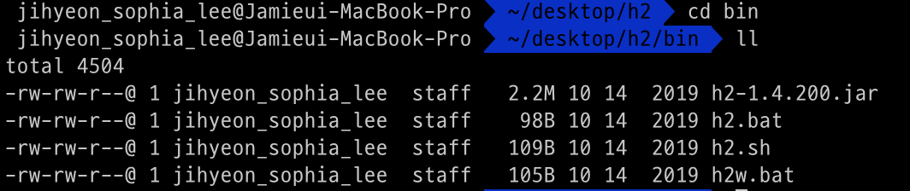
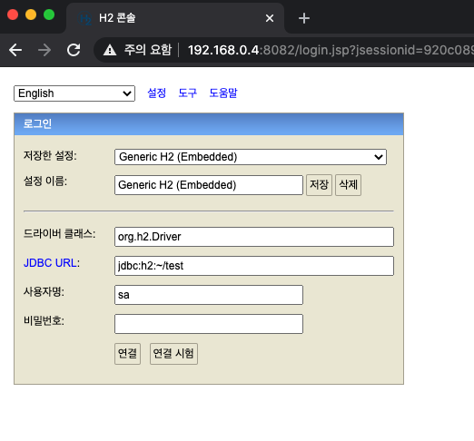
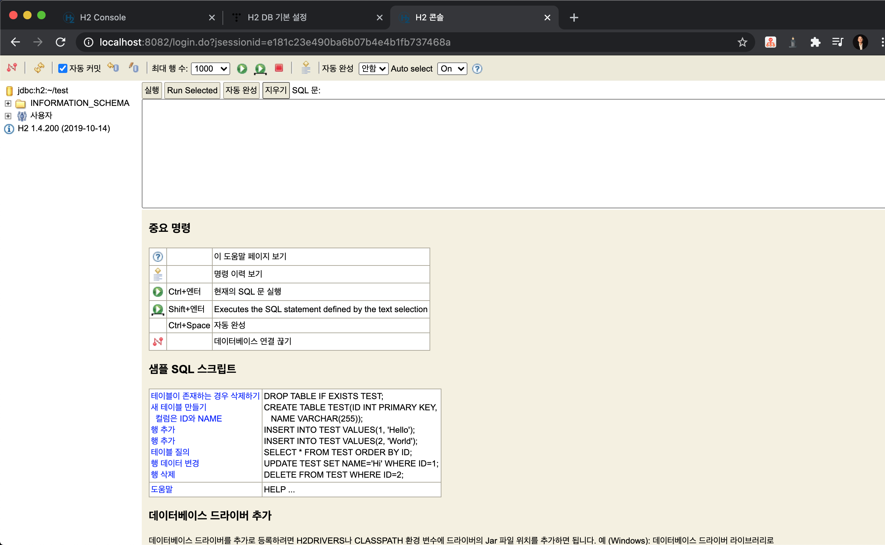
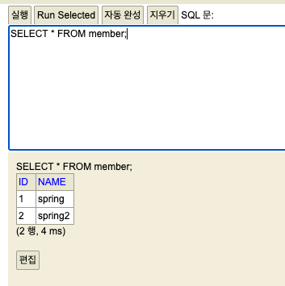
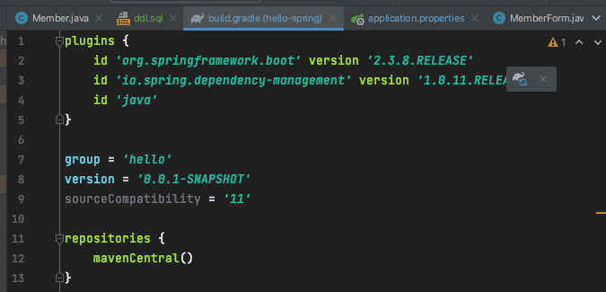

# 스프링 DB 접근 기술
## 1. H2 데이터베이스
### 1.1. 설치
용량이 작고 가벼우며 교육용으로 좋다.
- http://h2database.com/html/main.html
  - All Platforms 다운받은 후 압축해제
- 터미널 켜서 압축해제한 폴더로 들어간 후 
- `cd bin` 입력해서 바이너리 폴더로 들어가서 `ll` 입력하면<br/>
<br/>
- 이렇게 나오는데, 실행 파일(h2.sh)에 실행하는 권한을 줘야 함. 명령어는
```text
chmod 755 h2.sh
```
- 권한 준 후 실행하는 명령어는
```text
./h2.sh
```
- 그러면 잠시 후에<br/>
<br/>
- 웹 브라우저에 이렇게 뜸.
- 최초에는 데이터베이스 파일을 만들어줘야 함.
  - 저렇게 뜬 화면에서 그대로 둔 후 `연결` 누르면

```text
Database "/Users/jihyeon_sophia_lee/test" not found, either pre-create it or allow remote database creation (not recommended in secure environments) [90149-200] 90149/90149 (도움말)
```
- 이런 구구절절 에러가 떴다. 
  - 원인은 저 경로에 test 폴더가 없어서. 만들어주니 잘 됨.

- 결과화면
<br>

- +홈 디렉토리에 `test.mv.db` 파일 생성됨.
- 이후부터는 H2 콘솔의 `JDBC URL` 창에
```text
jdbc:h2:tcp://localhost/~/test
```
라고 입력해준다.
- 파일에 직접 접근하는 것이 아니라 소켓을 통해 접근하는 것
  - 이렇게 해야 여러 군데에서 접근할 수 있다.

### 1.2. 테이블 생성
```sql
DROP TABLE IF EXISTS member CASCADE;

CREATE TABLE member(
  id BIGINT GENERATED BY DEFAULT AS IDENTITY,
  name VARCHAR(255),
  PRIMARY KEY(id)MEMBER MEMBER MEMBER 

);
```
- BIGINT = Java의 Long 타입
- GENERATED BY DEFAULT AS IDENTITY: null값을 INSERT하면 DB가 자동으로 값을 넣어줌

### 1.3. 데이터 삽입
```sql
INSERT INTO member(name) values('spring');
INSERT INTO member(name) values('spring2');
```
- id 값을 넣지 않아도 자동으로 세팅해서 넣어준다.
- 결과


## 2. 작은 팁
- IntelliJ에서 프로젝트 바로 아래에 sql 디렉토리를 만들고, `ddl.sql`과 같이 sql 파일을 만들어서 관리하면 좋다.

## 2. 순수 JDBC

### 2.1. 관련 라이브러리 추가
`build.gradle` 파일에 jdbc, h2 데이터베이스 관련 라이브러리 추가.
```gradle
implementation 'org.springframework.boot:spring-boot-starter-jdbc'
runtimeOnly 'com.h2database:h2'
```

### 2.2. 접속 정보 추가
src/main/resources에 있는 application.properties 파일에 넣어준다.
```properties
spring.datasource.url=jdbc:h2:tcp://localhost/~/test
spring.datasource.driver-class-name=org.h2.Driver
```
- 이렇게 하면 `h2.Driver` 부분에 빨간 불이 뜨는데, import가 되지 않아서 그렇다.
  - build.gradle 파일에 뜬 코끼리 모양 클릭
<br/>
- 그러면 임포트되면서 빨간 불도 없어짐