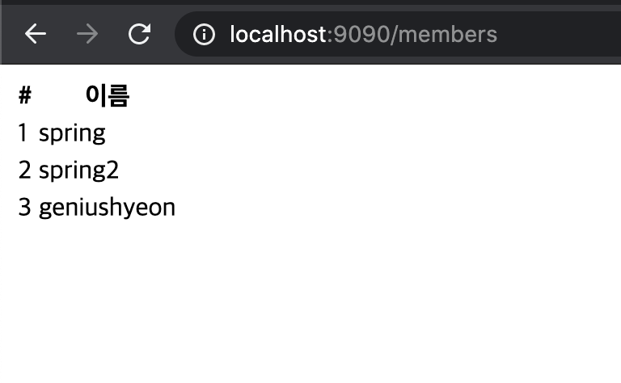

# 스프링 DB 접근 기술
## 2. 순수 JDBC

### 2.1. 관련 라이브러리 추가
`build.gradle` 파일에 jdbc, h2 데이터베이스 관련 라이브러리 추가.
```gradle
implementation 'org.springframework.boot:spring-boot-starter-jdbc'
runtimeOnly 'com.h2database:h2'
```

### 2.2. 접속 정보 추가
src/main/resources에 있는 application.properties 파일에 넣어준다.
```properties
spring.datasource.url=jdbc:h2:tcp://localhost/~/test
spring.datasource.driver-class-name=org.h2.Driver
```
- 이렇게 하면 `h2.Driver` 부분에 빨간 불이 뜨는데, import가 되지 않아서 그렇다.
  - build.gradle 파일에 뜬 코끼리 모양 클릭<br/>
<br/>
- 그러면 임포트되면서 빨간 불도 없어짐

### 2.3. JDBC로 구현 시작

#### 2.3.1. Jdbc 클래스 작성하기
MemberRepository 인터페이스를 만들어뒀기 때문에, 구현체를 만들면 된다.
- 💡 코드 자동 정렬: `cmd` + `opt` + `L`
  - 이클립스랑 헷갈리지 말자.<br/>
- 코드는 너무 길어서 생략하고 몇가지 체크 사항만 필기
1. Connection 얻어오는 메소드
- JdbcMemberRepository 생성자 안에 만들어줄 수도 있지만, 그렇게 되면 항상 새로운 커넥션이 만들어진다.
- 스프링 프레임워크를 통해 connection을 얻어올 때는 `DataSourceUtils`를 통해 얻어와야 한다.
  - 그러면 똑같은 connection으로 유지시켜준다. 스프링 프레임워크 사용할 때는 꼭 이렇게 해줄 것
```java
import org.springframework.jdbc.datasource.DataSourceUtils;

import javax.sql.DataSource;

private Connection getConnection() {
    return DataSourceUtils.getConnection(dataSource);
    }
```
2. 자원 해제(1) - JDBC
- 항상 일일이 닫아줬었는데 이렇게 메소드로 따로 빼는 것이 더 깔끔해보이고 좋은 듯. 다음 프로젝트에서는 이렇게 해보도록 하자
```java
    private void close(Connection conn, PreparedStatement pstmt, ResultSet rs) {
        try {

            if (rs != null) {
                rs.close();
            }
        } catch (SQLException e) {
            e.printStackTrace();
        }
        try {
            if (pstmt != null) {
                pstmt.close();
            }
        } catch (SQLException e) {
            e.printStackTrace();
        }
        try {
            if (conn != null) {
                close(conn);
            }
        } catch (SQLException e) {
            e.printStackTrace();
        }
    }
```
3. 자원 해제(2) - connection 닫아주기
- getConnection 때와 마찬가지로 DataSourceUtils를 이용해 닫아준다.
```java
 private void close(Connection conn) throws SQLException {
    DataSourceUtils.releaseConnection(conn, dataSource);
}
```
#### 2.3.2. config 해주기
- SpringConfig 클래스로 가서 Bean으로 `MemoryMemberRepository`를 등록해뒀던 것을 `JdbcMemberRepository`로 바꿔준다.
```java
@Bean
public MemberRepository memberRepository() {
//        return new MemoryMemberRepository();
    return new JdbcMemberRepository();
}
```
- ✔︎ 반환형 = `인터페이스`, `구현체만 바꿔주는 것` 체크!
  - 코드 수정 없이 configuration만 바꾸는 것!
- JdbcMemberRepository에서 생성자의 매개변수로 datasource를 줬기 때문에 Configuration에도 설정해줘야 함.
```java
private DataSource dataSource;

@Autowired
public SpringConfig(DataSource dataSource) {
    this.dataSource = dataSource;
}
```

### 2.4. 잘 되는지 테스트
1. cmd창 열어서 h2.sh 실행 중인지 확인
- 실행되지 않았다면 `h2/bin`까지 들어간 후 `./h2.sh` 명령어 입력해서 실행
2. IntelliJ에서 서버 실행
<br/>
- 회원가입, 목록 조회까지 잘 되는 것 확인 완료!

## 3. 오늘 배운 내용의 핵심
- 개방-폐쇄 원칙(OCP, Open-Closed Principle)
  - 확장에는 열려 있고 수정 및 변경에는 닫혀 있다
- Spring의 DI를 사용하면 `기존 코드를 전혀 손대지 않고 설정만으로 구현 클래스를 변경`할 수 있다.