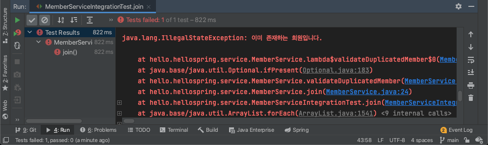
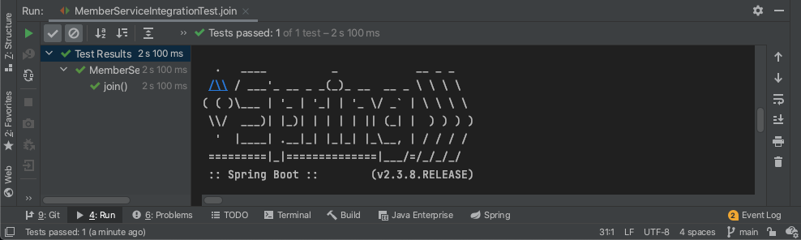
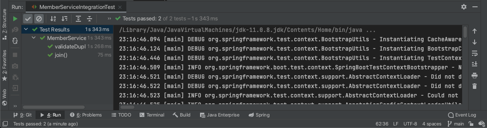

# 스프링 통합 테스트
이전에 했던 테스트들은 스프링과 관련 없는 테스트임(순수 Java 코드).
- 스프링이랑 엮어서 어떻게 테스트하는지 배울 것
  - DB까지 연결해서 테스트
- MemberServiceIntegrationTest.java
```java
package hello.hellospring.service;

import hello.hellospring.domain.Member;
import hello.hellospring.repository.MemberRepository;
import org.junit.jupiter.api.Test;
import org.springframework.beans.factory.annotation.Autowired;
import org.springframework.boot.test.context.SpringBootTest;
import org.springframework.transaction.annotation.Transactional;

import static org.assertj.core.api.Assertions.assertThat;
import static org.junit.jupiter.api.Assertions.assertThrows;

@SpringBootTest
@Transactional
class MemberServiceIntegrationTest {

    // 필드 레벨에서 Autowired로 의존성 주입
    @Autowired
    MemberService memberService;
    @Autowired
    MemberRepository memoryMemberRepository;

    @Test
    void join() {
        // given
        Member member = new Member();
        member.setName("spring");
        // when
        Long savedId = memberService.join(member);

        // then
        // 저장한게 repository에 있는게 맞아?
        Member findMember = memberService.findOne(savedId).get();
        assertThat(member.getName()).isEqualTo(findMember.getName());

    }

    @Test
    public void validateDuplicatedCheck() {
        // given
        Member member1 = new Member();
        member1.setName("spring");

        Member member2 = new Member();
        member2.setName("spring");

        // when
        memberService.join(member1);
        IllegalStateException e = assertThrows(IllegalStateException.class, () -> memberService.join(member2));
        assertThat(e.getMessage()).isEqualTo("이미 존재하는 회원입니다.");

    }
}
```
이렇게 하고 회원가입 테스트를 돌려보면<br/>
<br/>
- DB와 연결을 해뒀고, 지난 시간에 spring이라는 이름으로 회원가입을 했기 때문에 오류 발생
  - DB에 있는 데이터 지워주고 시작하기
```sql
DELETE from MEMBER;
```
- 보통 실무에서는 테스트용 DB를 따로 구축한다.<br/>

지우고 나서 다시 테스트해보면<br/>
<br/>
- 테스트임에도 스프링이 돌아가는 것을 확인할 수 있다.
- `@SpringBootTest` 어노테이션이 붙으면 스프링 컨테이너와 테스트를 함께 실행한다.

## `@Transactional`에 대하여
테스트 케이스에 이 어노테이션이 붙으면 테스트를 실행할 때 
1) 테스트 시작 전에 트랜잭션을 먼저 실행하고 
2) 쿼리문을 날려 테스트를 실행한 후
3) 테스트가 끝나면 `rollback`을 시켜준다.
- DB에 쿼리문이 반영되지 않음
  - 전 테스트에서 했던 @BeforeEach, @AfterEach 등등 쓸 필요 없음

## 그러면 순수 Java로 된 테스트 케이스가 필요없느냐?
- 순수 Java 코드를 이용해 단위별로 테스트하는 것을 `단위 테스트`, 스프링 컨테이너와 연동하여 테스트하는 것을 `통합 테스트`라고 표현한다.
- `단위 테스트`가 좋은 테스트일 확률이 높다.

# 스프링 JdbcTemplate
- 순수 JDBC와 동일하게 환경 설정을 하면 된다.
- JDBC API에서 본 반복 코드를 대부분 제거해준다.
  - SQL은 직접 작성해야 한다.

## JdbcTemplate
spring이 제공해주는 템플릿. 사용 방법은<br/>
1. 필드의 멤버로 생성해주고
2. 생성자에서 생성해줌(DataSource를 곁들여서)
```java
// 생성자가 하나만 있을 경우에는 어노테이션 생략 가능
@Autowired
public JdbcTemplateMemberRepository(DataSource dataSource) {
    this.jdbcTemplate = new JdbcTemplate(dataSource);
    }
```
## RowMapper<T>
처음 보는 아이여서 뭔지도 모르고 따라 침.. [공부는 여기에 정리]()
```java
private RowMapper<Member> memberRowMapper() {
  return new RowMapper() {
    @Override
    public Member mapRow(ResultSet rs, int rowNum) throws SQLException {

      Member member = new Member();
      member.setId(rs.getLong("id"));
      member.setName(rs.getString("name"));

      return member;
    }
  }
}
```

- 람다로 바꾸면
```java
private RowMapper<Member> memberRowMapper() {
  return (rs, rowNum) -> {
    Member member = new Member();
    member.setId(rs.getLong("id"));
    member.setName(rs.getString("name"));

    return member;
  };
}
```

## 각 메소드 재정의
- memberRowMapper()를 파라미터로 넣어준다.
```java
    @Override
    public Member save(Member member) {
        SimpleJdbcInsert jdbcInsert = new SimpleJdbcInsert(jdbcTemplate);
        // 쿼리를 짤 필요가 없음
        jdbcInsert.withTableName("member").usingGeneratedKeyColumns("id");

        Map<String, Object> parameters = new HashMap<>();
        parameters.put("name" , member.getName());

        Number key = jdbcInsert.executeAndReturnKey(new MapSqlParameterSource(parameters));
        member.setId(key.longValue());

        return member;
    }

    @Override
    public Optional<Member> findById(Long id) {
        List<Member> result = jdbcTemplate.query("SELECT * FROM member WHERE id = ?", memberRowMapper(), id);

        return result.stream().findAny(); // Optional로 반환
    }

    @Override
    public Optional<Member> findByName(String name) {
        // 쿼리 날리고 결과를 RowMapper를 통해 매핑하고 List로 받음
        List<Member> result = jdbcTemplate.query("SELECT * FROM member WHERE name = ?", memberRowMapper(), name);
        // 받은 결과를 Optional로 바꿔서 반환
        return result.stream().findAny();
    }

    @Override
    public List<Member> findAll() {
      // List로 반환
      return jdbcTemplate.query("SELECT * FROM member", memberRowMapper());
    }
```
### save 메소드
- 테이블명과 PK 값을 이용. 역시 쿼리문을 쓸 필요가 없다.

## SpringConfig 파일 설정
```java
    @Bean
    public MemberRepository memberRepository() {
//        return new MemoryMemberRepository();
//        return new JdbcMemberRepository(dataSource);
        return new JdbcTemplateMemberRepository(dataSource);

    }
```

## 테스트
- Spring 통합 테스트 코드를 작성하였으므로, WAS를 띄울 필요 없이 테스트 코드를 바로 실행시키면 됨.
- 💡 `ctrl + R`: 제일 마지막에 실행시킨 코드를 실행함(cmd 아니고 `ctrl`)

- 테스트 결과

- 성공!