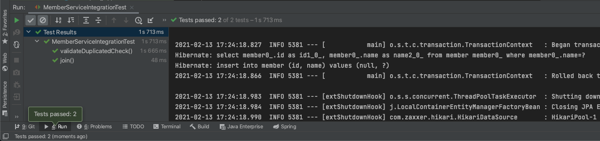
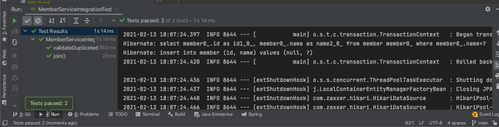

# JPA
- 자바 퍼시스턴트 API
- 기존의 반복 코드 + 기본적인 SQL도 직접 만들어서 실행해줌
- SQL과 데이터 중심의 설계 -> 객체 중심의 설계로 패러다임 전환 가능
- 개발 생산성이 크게 높아짐
- 세계적으로 MyBatis보다 훨씬 많이 사용하는 추세
- JPA는 인터페이스, 구현체로 hibernate, eclipse 등등이 있음
## 1. 세팅전
1. build.gradle 파일에 JPA, h2 데이터베이스 관련 라이브러리 추가
```gradle
//	implementation 'org.springframework.boot:spring-boot-starter-jdbc' // 주석 처리
	implementation 'org.springframework.boot:spring-boot-starter-data-jpa'
```
2. application.properties 파일에 추가
```properties
spring.jpa.show-sql=true
spring.jpa.hibernate.ddl-auto=none
```
- jpa가 날리는 sql을 볼 수 있다.
- jpa는 객체를 보고 테이블을 자동으로 생성해주는데, 만들어둔 테이블이 있기 때문에 자동 생성을 `none`으로 설정한다.
  - 자동 생성 옵션: `create`

## 2. 본격적으로 시작!
1. 개체 역할을 하는 클래스로 가서 어노테이션을 달아준다.
```java
package hello.hellospring.domain;

import javax.persistence.Entity;
import javax.persistence.GeneratedValue;
import javax.persistence.Id;

@Entity
public class Member {

    @Id
    @GeneratedValue(strategy = GenerationType.IDENTITY)
    private Long id;
    private String name;

    public Long getId() {
        return id;
    }

    public void setId(Long id) {
        this.id = id;
    }

    public String getName() {
        return name;
    }

    public void setName(String name) {
        this.name = name;
    }
}

```
- `@Entity`: 클래스 위에 달아줌
- `@Id`: PK
- `@GeneratedValue`: 오라클에서 sequence와 같은 개념
  - GenerationType.IDENTITY: DB가 알아서 생성해주는 것

2. MemberRepository의 구현체 생성

- JPA 사용을 위해 필드에 EntityManager를 만들어줘야함

```java
package hello.hellospring.repository;

import hello.hellospring.domain.Member;

import javax.persistence.EntityManager;
import java.util.List;
import java.util.Optional;

public class JpaMemberRepository implements MemberRepository {

    private final EntityManager em;

    public JpaMemberRepository(EntityManager em) {
        this.em = em;
    }

    @Override
    public Member save(Member member) {
        em.persist(member); // 쿼리 만들어서 알아서 집어넣음
        return member;
    }

    @Override
    public Optional<Member> findById(Long id) {
        Member member = em.find(Member.class, id);
        return Optional.ofNullable(member);
    }

    @Override
    public Optional<Member> findByName(String name) {
        // jpql을 써야함
         List<Member> result = em.createQuery("SELECT m FROM Member m WHERE m.name= :name", Member.class)
                .setParameter("name", name)
                .getResultList();

         return result.stream().findAny();
    }

    @Override
    public List<Member> findAll() {
        return em.createQuery("SELECT m FROM Member m", Member.class)
                .getResultList();
    }
}
```
- SELECT m FROM Member m
  - JPQL에서는 Entity 자체를 Select함.
- SELECT문 빼고는 JPA가 쿼리문을 만들어줌.

3. 서비스 클래스에 어노테이션 달아주기
- `@Transactional` 어노테이션을 달아준다.
  - 모든 데이터 변경이 트랜잭션 내에서 실행되어야 한다.

4. SpringConfig 코드 변경
- return 값을 JpaMemberRepository로 해준다.
  - EntityManager가 필요하므로 생성자를 통해 DI해준다.

```java
package hello.hellospring;

import hello.hellospring.repository.*;
import hello.hellospring.service.MemberService;
import org.springframework.beans.factory.annotation.Autowired;
import org.springframework.context.annotation.Bean;
import org.springframework.context.annotation.Configuration;

import javax.persistence.EntityManager;
import javax.sql.DataSource;

@Configuration
public class SpringConfig {

    private EntityManager em;

    @Autowired
    public SpringConfig(EntityManager em) {
        this.em = em;
    }
    @Bean
    public MemberService memberService() {
        return new MemberService(memberRepository());
    }

    @Bean
    public MemberRepository memberRepository() {
//        return new MemoryMemberRepository();
//        return new JdbcMemberRepository(dataSource);
//        return new JdbcTemplateMemberRepository(dataSource);
        return new JpaMemberRepository(em);
    }
}

```

5. 통합 테스트 코드로 가서 테스트
<br/>
- 쿼리문 생성 후 테스트되는 것 확인 완료

# 스프링 데이터 JPA
- JPA를 편리하게 사용할 수 있도록 도와주는 기술
## 1. SpringDataJpaMemberRepository 생성
1. org.springframework.data.jpa.repository 안에 있는 JpaRepository 상속
2. 앞서 만들어 두었던 MemberRepository 상속
- 인터페이스는 `다중 상속` 가능
```java
package hello.hellospring.repository;

import hello.hellospring.domain.Member;
import org.springframework.data.jpa.repository.JpaRepository;

import java.util.Optional;

public interface SpringDataJpaMemberRepository extends JpaRepository<Member, Long>, MemberRepository {

    @Override
    Optional<Member> findByName(String name);
}

```
이렇게 구현체를 만들면 스프링이 알아서 구현체를 만든 후 Bean을 등록해줌
- 그 구현체를 가져다 쓴다.
## 2. Config.java 파일 수정
- memberRepository를 DI해주면 끝!
  - 1번에서 만든 SpringDataJpaMemberRepository에서 MemberRepository를 상속했으므로 스프링이 알아서 등록해준다.

```java
package hello.hellospring;

import hello.hellospring.repository.*;
import hello.hellospring.service.MemberService;
import org.springframework.beans.factory.annotation.Autowired;
import org.springframework.context.annotation.Bean;
import org.springframework.context.annotation.Configuration;

@Configuration
public class SpringConfig {

    private final MemberRepository memberRepository;

    @Autowired
    public SpringConfig(MemberRepository memberRepository) {
        this.memberRepository = memberRepository;
    }

    @Bean
    public MemberService memberService() {
        return new MemberService(memberRepository);
    }
}
```

## 3. 통합 테스트
<br/>
- 성공! ㅇ0ㅇ

## 4. 원리
1. 스프링이 알아서 SpringDataJpaMemberRepository를 스프링 빈으로 등록
- findByName만 Override했는데 그럼 다른 메소드들은 어디에 있나?
2. SpringDataJpaMemberRepository가 상속받은 JpaRepository 인터페이스로 가보면
```java
/*
생략
 */
package org.springframework.data.jpa.repository;

import java.util.List;

import javax.persistence.EntityManager;

import org.springframework.data.domain.Example;
import org.springframework.data.domain.Sort;
import org.springframework.data.repository.NoRepositoryBean;
import org.springframework.data.repository.PagingAndSortingRepository;
import org.springframework.data.repository.query.QueryByExampleExecutor;

/**
 * JPA specific extension of {@link org.springframework.data.repository.Repository}.
 *
 * @author Oliver Gierke
 * @author Christoph Strobl
 * @author Mark Paluch
 */
@NoRepositoryBean
public interface JpaRepository<T, ID> extends PagingAndSortingRepository<T, ID>, QueryByExampleExecutor<T> {

	/*
	 * (non-Javadoc)
	 * @see org.springframework.data.repository.CrudRepository#findAll()
	 */
	@Override
	List<T> findAll();

	/*
	 * (non-Javadoc)
	 * @see org.springframework.data.repository.PagingAndSortingRepository#findAll(org.springframework.data.domain.Sort)
	 */
	@Override
	List<T> findAll(Sort sort);

	/*
	 * (non-Javadoc)
	 * @see org.springframework.data.repository.CrudRepository#findAll(java.lang.Iterable)
	 */
	@Override
	List<T> findAllById(Iterable<ID> ids);

	/*
	 * (non-Javadoc)
	 * @see org.springframework.data.repository.CrudRepository#save(java.lang.Iterable)
	 */
	@Override
	<S extends T> List<S> saveAll(Iterable<S> entities);

	/**
	 * Flushes all pending changes to the database.
	 */
	void flush();

	/**
	 * Saves an entity and flushes changes instantly.
	 *
	 * @param entity
	 * @return the saved entity
	 */
	<S extends T> S saveAndFlush(S entity);

	/**
	 * Deletes the given entities in a batch which means it will create a single {@link Query}. Assume that we will clear
	 * the {@link javax.persistence.EntityManager} after the call.
	 *
	 * @param entities
	 */
	void deleteInBatch(Iterable<T> entities);

	/**
	 * Deletes all entities in a batch call.
	 */
	void deleteAllInBatch();

	/**
	 * Returns a reference to the entity with the given identifier. Depending on how the JPA persistence provider is
	 * implemented this is very likely to always return an instance and throw an
	 * {@link javax.persistence.EntityNotFoundException} on first access. Some of them will reject invalid identifiers
	 * immediately.
	 *
	 * @param id must not be {@literal null}.
	 * @return a reference to the entity with the given identifier.
	 * @see EntityManager#getReference(Class, Object) for details on when an exception is thrown.
	 */
	T getOne(ID id);

	/*
	 * (non-Javadoc)
	 * @see org.springframework.data.repository.query.QueryByExampleExecutor#findAll(org.springframework.data.domain.Example)
	 */
	@Override
	<S extends T> List<S> findAll(Example<S> example);

	/*
	 * (non-Javadoc)
	 * @see org.springframework.data.repository.query.QueryByExampleExecutor#findAll(org.springframework.data.domain.Example, org.springframework.data.domain.Sort)
	 */
	@Override
	<S extends T> List<S> findAll(Example<S> example, Sort sort);
}

```
- findByName은 공통 클래스에서 제공하지 않기 때문에 MemberRepository를 상속받아 구현했던 것

### 4.1. 스프링 데이터 JPA 제공 깅능
- 인터페이스를 통한 기본적인 CRUD
- 페이징 기능 자동 제공