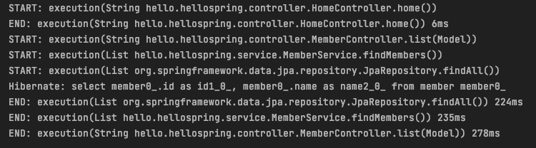
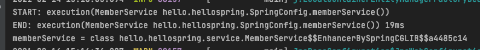

# AOP
# 1. AOP가 필요한 상황
- 모든 메소드의 호출 시간을 측정하고 싶다면?
- 공통 관심 사항(cross-cutting concern) vs 핵심 관심 사항(core concern)
- 회원 가입 시간, 회원 조회 시간을 측정하고 싶다면?
## 1.1. AOP를 사용하지 않고 일일이 쓴다면..
```java
public Long join(Member member) {
    long start = System.currentTimeMillis();

    try {

        validateDuplicatedMember(member); // 중복 회원 검증
        memberRepository.save(member);

        return member.getId();
    } finally {
        long finish = System.currentTimeMillis();
        long timeMs = finish - start;
        System.out.println("join: " + timeMs + "ms");
    }

}
```
- 이런 코드를 모든 메소드에 써야 함.. 메소드가 1000개면 1000개 모두에..

## 1.2. 문제
- 회원가입, 회원 조회에서 시간을 측정하는 기능은 핵심 관심 사항이 아닌 `공통 관심 사항`
- 시간 측정 로직 + 핵심 비즈니스 로직이 섞여 유지보수가 어려움
- 시간 측정 로직을 별도의 공통 로직으로 만들기 매우 어려움
- 시간 측정 로직을 변경할 때 모든 로직을 찾아가며 변경해야 함

# 2. AOP 적용
- AOP: Aspected Oriented Programming(관점 지향 프로그래밍)
- 공통 관심사와 핵심 관심사를 분리 -> 원하는 곳에 공통 관심 사항 적용

## 2.1. 실습
1. aop 패키지를 만든 후, 시간 측정 로직 클래스를 만들어준다.
```java
package hello.hellospring.aop;

import org.aspectj.lang.ProceedingJoinPoint;
import org.aspectj.lang.annotation.Aspect;

@Aspect
public class TimeTraceAop {

    public Object execute(ProceedingJoinPoint joinPoint) throws Throwable {

        long start = System.currentTimeMillis();
        System.out.println("START: " + joinPoint.toString());

        try {
            return joinPoint.proceed();

        } finally {
            long finish = System.currentTimeMillis();
            long timeMs = finish - start;
            System.out.println("END: " + joinPoint.toString() + " " + timeMs + "ms");
        }
    }
}
```
- `@Aspect` 어노테이션 달아주기
- joinPoint: AOP가 실행되는 시점

2. SpringConfig로 가서 Bean에 등록해준다.
```java
@Bean
public TimeTraceAop timeTraceAop() {
    return new TimeTraceAop();
}
```
또는
- TimeTraceAop 클래스를 컴포넌트 스캔
  - `@Component` 어노테이션 달아주기

3. (!중요) execute 메소드 위에 `@Around` 어노테이션 달아주기
```java
@Around("execution(* hello.hellospring..*(..))")
public Object execute(ProceedingJoinPoint joinPoint) throws Throwable {

    long start = System.currentTimeMillis();
    System.out.println("START: " + joinPoint.toString());

    try {
        return joinPoint.proceed();

    } finally {
        long finish = System.currentTimeMillis();
        long timeMs = finish - start;
        System.out.println("END: " + joinPoint.toString() + " " + timeMs + "ms");
    }
}
```
- hello.hellospring 하위에 있는 모든 패키지, 모든 메소드, 모든 파라미터에 대해 적용하라

4. 서버 띄워서 확인하면
- 콘솔창에 정상적으로 sysout된다.<br/>


- 💡 `cmd + opt + L` : (맨날 헷갈리는) 코드 자동 정렬

## 2.2. 해결
1. 핵심 관심사(회원가입, 회원 조회 등)와 공통 관심사(시간 측정)를 분리
2. 시간 측정 로직을 별도의 공통 로직으로 만듦
3. 핵심 관심사를 깔끔하게 유지 + 변경이 필요하면 공통 관심사 로직만 변경하면 됨
4. 원하는 적용 대상을 선택할 수 있음(`포인트컷 표현식`에서 설정)

## 2.3. 동작 방식
- AOP 적용 전: memberController에서 memberService를 직접 부름
- AOP 적용 후: 프록시(가짜) memberService를 먼저 호출 -> `joinPoint.proceed()`될 때 찐 memberService 호출
  - MemberController에서 MemberService DI하는 부분에 아래 코드를 추가함으로써 확인 가능.
```java
@Autowired
public MemberController(MemberService memberService) {
    this.memberService = memberService;
    System.out.println("memberService = " + memberService.getClass());
}
```
- 서버 실행 결과<br/>
<br/>
- MemberService 뒤에 블라블라블라 붙어 있음
  - MemberService를 복제해서 코드를 조작하는 기술