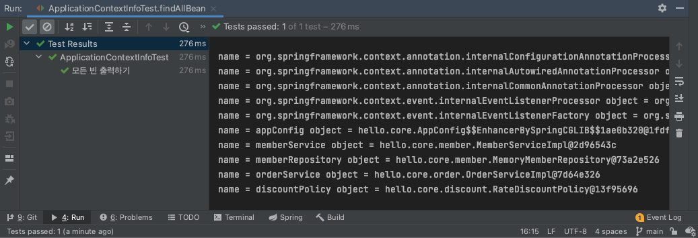

# 스프링 컨테이너와 스프링 빈
## 1. 스프링 컨테이너 생성
```java
// 스프링 컨테이너 생성
ApplicationContext applicationContext = new AnnotationConfigApplicationContext(AppConfig.class);
// 하략
```
- `ApplicationContext`를 스프링 컨테이너라 한다(인터페이스).
- 스프링 컨테이너는 XML 기반으로 만들 수도 있고, 어노테이션 기반의 자바 설정 클래스로도 만들 수 있다.
  - 요즘은 자바 설정 클래스 방식을 많이 쓰는 추세
  - `AnnotationConfigApplicationContext`는 `ApplicationContext`의 구현체

1. 스프링 컨테이너 생성
- 스프링 컨테이너를 생성할 때는 `구성 정보`를 지정해주어야 함
  - AppConfig.class
2. 스프링 빈 등록
- 파라미터로 넘어온 설정 클래스 정보를 사용해 스프링 빈 등록
3. 스프링 빈 의존관계 설정 - 준비
- 빈 이름은 메서드 이름 사용, 임의로 부여할 수도 있음
  - 주의: 빈 이름은 항상 다른 이름을 부여할 것
4. 스프링 빈 의존관계 설정 - 완료

## 2. 컨테이너에 등록된 모든 빈 조회
- 💡 enhanced for문: `iter` + `Tab`
```java
package hello.core.beanfind;

import hello.core.AppConfig;
import org.junit.jupiter.api.DisplayName;
import org.junit.jupiter.api.Test;
import org.springframework.context.annotation.AnnotationConfigApplicationContext;

public class ApplicationContextInfoTest {

    AnnotationConfigApplicationContext ac = new AnnotationConfigApplicationContext(AppConfig.class);

    @Test
    @DisplayName("모든 빈 출력하기")
    void findAllBean() {
        String[] beanDefinitionNames = ac.getBeanDefinitionNames();
        for (String beanDefinitionName : beanDefinitionNames) {
            Object bean = ac.getBean(beanDefinitionName);
            System.out.println("name = " + beanDefinitionName + " object = " + bean);
        }
    }
}
```
- 실행 결과<br/>
<br/>
- 💡 코드 복제: `cmd` + `D`
- 직접 등록한 빈만 출력해보자
```java
@Test
@DisplayName("애플리케이션 빈 출력하기")
void findApplicationBean() {
    String[] beanDefinitionNames = ac.getBeanDefinitionNames();
    for (String beanDefinitionName : beanDefinitionNames) {
        BeanDefinition beanDefinition = ac.getBeanDefinition(beanDefinitionName);

        // ROLE_APPLICATION: 직접 등록한 애플리케이션 빈
        // ROLE_INFRASTRUCTURE: 스프링이 내부에서 사용하는 빈
        if (beanDefinition.getRole() == BeanDefinition.ROLE_APPLICATION) {
            Object bean = ac.getBean(beanDefinitionName);
            System.out.println("name = " + beanDefinitionName + " object = " + bean);
        }
    }
}
```

## 3. 스프링 빈 조회 - 기본
스프링 컨테이너에서 스프링 빈을 찾는 가장 기본적인 조회 방법
- `ac.getBean(빈이름, 타입)`
- `ac.getBean(타입)`
- 조회 대상 스프링 빈이 없으면 예외 발생
  - NoSuchBeanDefinitionException: No bean named 어쩌구 available
- [ApplicationContextBasicFindTest.java](/core/src/test/java/hello/core/discount/RateDiscountPolicyTest.java)

## 4. 스프링 빈 조회 - 동일한 타입이 둘 이상
- 타입으로 조회 시 같은 타입의 스프링 빈이 둘 이상이면 오류 발생 -> 이때는 빈 이름 지정해주기
- `ac.getBeansOfType()` 사용하여 해당 타입의 모든 빈 조회 가능
- NoUniqueBeanDefinitionException
- [ApplicationContextSameBeanFindTest.java](/core/src/test/java/hello/core/beanfind/ApplicationContextSameBeanFindTest.java)

## 5. 스프링 빈 조회 - 상속 관계
- 부모 타입으로 조회하면, 자식 타입도 조회한다.
- 그래서 모든 자바 객체의 최고 부모인 `Object` 타입으로 조회하면, 모든 스프링 빈을 조회한다.
- [ApplicationContextExtendsFindTest.java](/core/src/test/java/hello/core/beanfind/ApplicationContextExtendsFindTest.java)

## 6. BeanFactory와 ApplicationContext
### 6.1. BeanFactory
- 스프링 컨테이너의 최상위 인터페이스
- 스프링 빈을 관리하고 조회하는 역할 담당
- getBean() 메서드 제공

### 6.2. ApplicationContext
- BeanFactory의 기능을 모두 상속받아서 제공
  - BeanFactory와의 차이는?

#### 6.2.1. ApplicationContext가 제공하는 부가 기능
- 메시지소스를 활용한 국제화 기능
  - ex. 한국에서 들어오면 한국어로, 영어권에서 들어오면 영어로 출력
- 환경변수
  - 로컬, 개발, 운영 등을 구분해서 처리
- 애플리케이션 이벤트
  - 이벤트를 발행하고 구독하는 모델을 편리하게 지원
- 편리한 리소스 조회
  - 파일, class path, 외부 등에서 리소스를 편리하게 조회

### 6.3. 정리
- ApplicationContext는 BeanFactory의 기능을 상속받음
- ApplicationContext는 빈 관리 기능 + 편리한 부가 기능 제공
- BeanFactory를 직접 사용할 일은 거의 없음
- BeanFactory, ApplicationContext == 스프링 컨테이너

## 7. 다양한 설정 형식 지원 - 자바 코드, XML
- 스프링 컨테이너는 다양한 형식의 설정 정보를 받아들일 수 있도록 유연하게 설계되어 있다.
  - 자바 코드, XML, Groovy 등등

### 7.1. 어노테이션 기반 자바 코드 설정 사용
- `new AnnotationConfigApplicationContext(AppConfig.class)`
- AnnotationConfigApplicationContext 클래스를 사용하면서 자바 코드로 된 설정 정보를 넘기면 됨

### 7.2. XML 설정 사용
- 최근에는 스프링 부트를 많이 사용하면서 XML 기반의 설정은 잘 사용하지 않음
- XML을 사용하면 컴파일 없이 빈 설정 정보를 변경할 수 있는 장점이 있음
- `GenericXmlApplicationContext`를 사용하면서 xml 설정 파일을 넘기면 됨
- resources 폴더에 appConfig.xml 만들기
```xml
<?xml version="1.0" encoding="UTF-8"?>
<beans xmlns="http://www.springframework.org/schema/beans"
       xmlns:xsi="http://www.w3.org/2001/XMLSchema-instance"
       xsi:schemaLocation="http://www.springframework.org/schema/beans http://www.springframework.org/schema/beans/spring-beans.xsd">
    <bean id="memberService" class="hello.core.member.MemberServiceImpl">
        <constructor-arg name="memberRepository" ref="memberRepository"/>
    </bean>

    <bean id="memberRepository" class="hello.core.member.MemoryMemberRepository"/>

    <bean id="orderService" class="hello.core.order.OrderServiceImpl">
        <constructor-arg name="memberRepository" ref="memberRepository"/>
        <constructor-arg name="discountPolicy" ref="discountPolicy"/>
    </bean>

    <bean id="discountPolicy" class="hello.core.discount.RateDiscountPolicy"/>

</beans>
```
- 테스트 코드 만들기
```java
package hello.core.xml;

import hello.core.member.MemberService;
import org.junit.jupiter.api.Test;
import org.springframework.context.ApplicationContext;
import org.springframework.context.support.GenericXmlApplicationContext;

import static org.assertj.core.api.Assertions.*;

public class XmlAppContext {

    @Test
    void xmlAppContext() {
        ApplicationContext ac = new GenericXmlApplicationContext("appConfig.xml");
        MemberService memberService = ac.getBean("memberService", MemberService.class);
        assertThat(memberService).isInstanceOf(MemberService.class);
    }
}
```

## 8. 스프링 빈 설정 메타 정보 - BeanDefinition
- 스프링은 어떻게 이런 다양한 설정 형식을 지원하는 것일까?
  - `BeanDefinition`이라는 추상화
  - 역할과 구현을 개념적으로 나눈 것: 스프링 컨테이너는 자바 코드인지, XML인지 몰라도 된다. 오직 BeanDefinition만 알면 된다.
```java
package hello.core.beandefinition;

import hello.core.AppConfig;
import org.junit.jupiter.api.DisplayName;
import org.junit.jupiter.api.Test;
import org.springframework.beans.factory.config.BeanDefinition;
import org.springframework.context.annotation.AnnotationConfigApplicationContext;

public class BeanDefinitionTest {
    AnnotationConfigApplicationContext ac = new AnnotationConfigApplicationContext(AppConfig.class);

    @Test
    @DisplayName("Bean Definition Check")
    void findApplicationBean() {
        String[] beanDefinitionNames = ac.getBeanDefinitionNames();
        for (String beanDefinitionName : beanDefinitionNames) {
            BeanDefinition beanDefinition = ac.getBeanDefinition(beanDefinitionName);

            if (beanDefinition.getRole() == BeanDefinition.ROLE_APPLICATION) {
                System.out.println("beanDefinitionName = " + beanDefinitionName + " beanDefinition = " + beanDefinition);
            }
        }
    }

}
```